# Architecture: Extreme Weather Anomaly Tracking and Downscaling

This document describes the technical design of the pipeline summarised in [`README.md`](./README.md).

## Table of contents

1. [Goals and constraints](#1-goals-and-constraints)
2. [System overview](#2-system-overview)
3. [Data layer](#3-data-layer)
4. [Stage 0: Preprocessing and EFI](#4-stage-0-preprocessing-and-efi)
5. [Stage 1: Spherical anomaly tracker (GNN)](#5-stage-1-spherical-anomaly-tracker-gnn)
6. [Stage 2: Amplitude-preserving downscaler (diffusion)](#6-stage-2-amplitude-preserving-downscaler-diffusion)
7. [Physics-informed constraints](#7-physics-informed-constraints)
8. [Alert engine](#8-alert-engine)
9. [Serving layer (API and dashboard)](#9-serving-layer-api-and-dashboard)
10. [Training and evaluation](#10-training-and-evaluation)
11. [Deployment and operations](#11-deployment-and-operations)
12. [Performance budget](#12-performance-budget)
13. [Design decisions and alternatives](#13-design-decisions-and-alternatives)
14. [Risks and mitigations](#14-risks-and-mitigations)

---

## 1. Goals and constraints

**Goals**

- Detect and track extreme anomalies in global ensemble forecasts at lead times of 3 to 10 days.
- Produce a 5 km impact map for the anomaly region that preserves extreme amplitudes.
- Deliver categorised, geographically precise alerts through an API and dashboard.

**Constraints**

- Input resolution is 12 km (NEPS-G), output is 5 km (ratio about 2.4, non-integer).
- Inputs are large 4D ensemble arrays (member, time, level/variable, lat, lon) in GRIB2/NetCDF.
- Extreme events are rare, so training data is imbalanced.
- Inference should run on a single cloud GPU node in seconds to minutes per forecast cycle.
- Outputs must be scientifically defensible: calibrated, physically plausible, and verifiable.

## 2. System overview

```mermaid
flowchart LR
    subgraph SRC[Data sources]
        A1[NEPS-G 12 km ensemble]
        A2[NCUM 12 km deterministic]
        A3[ERA5 / IMDAA climatology]
        A4[Static fields: orography, land-sea mask]
        A5[High-res target data - training only]
    end

    subgraph ING[Ingestion and preprocessing]
        B1[GRIB2/NetCDF reader - Xarray + Dask]
        B2[Quality control + unit harmonisation]
        B3[Climatology + EFI/SOT computation]
        B4[Zarr cache]
    end

    subgraph S1[Stage 1: Tracker]
        C1[Grid to icosahedral mesh encoder]
        C2[Mesh message-passing GNN]
        C3[Mesh to grid decoder]
        C4[Anomaly mask + centre per lead time]
        C5[Tracker: link detections into trajectories + 4D boxes]
    end

    subgraph S2[Stage 2: Downscaler]
        D1[Crop + regrid to 5 km target grid]
        D2[Conditional diffusion model]
        D3[Physics-informed loss during training / guidance at sampling]
        D4[N samples: mean, peak, exceedance probability]
    end

    subgraph AL[Alert engine]
        E1[Threshold + category rules]
        E2[Core point + 5 km radius geometry]
    end

    subgraph SV[Serving]
        F1[(PostGIS + object store)]
        F2[FastAPI REST]
        F3[React dashboard]
    end

    A1 --> B1
    A2 --> B1
    A3 --> B3
    A4 --> D1
    B1 --> B2 --> B3 --> B4
    B4 --> C1 --> C2 --> C3 --> C4 --> C5
    C5 --> D1 --> D2 --> D4
    D3 -.-> D2
    A5 -.-> D2
    D4 --> E1 --> E2 --> F1
    C5 --> F1
    F1 --> F2 --> F3
```



**Control flow per forecast cycle**

1. A scheduler detects a new NEPS-G cycle and triggers ingestion.
2. Stage 0 builds EFI fields and caches them.
3. Stage 1 returns anomalies with trajectories and bounding boxes.
4. For each anomaly, Stage 2 downscales the cropped region at the relevant lead times.
5. The alert engine writes alerts and tracks to storage.
6. The API and dashboard serve the latest cycle immediately.

## 3. Data layer

### 3.1 Inputs

| Dataset | Resolution | Use |
|---|---|---|
| NEPS-G | 12 km, N ensemble members | Primary forecast input |
| NCUM | 12 km | Optional deterministic context |
| ERA5 / IMDAA | 0.25° / 12 km | Climatology baseline, training truth at coarse scale |
| Static fields | Matched to target grids | Conditioning for the downscaler |
| High-resolution target | About 5 km or finer | Supervised target for Stage 2 (CHIRPS / Radar) |

### 3.2 Variables (initial scope)

- Heat/cold: 2 m temperature, 850 hPa temperature, geopotential height at 500 hPa (for heat-dome structure).
- Rain/cyclone: total precipitation, 10 m wind, mean sea level pressure, integrated vapour transport or specific humidity at several levels, relative vorticity at 850 hPa.

Start with one hazard and one variable (for example rainfall), then widen.

### 3.3 Storage and caching

- Raw GRIB2/NetCDF read lazily with Xarray (cfgrib) and chunked with Dask.
- Processed fields stored as **Zarr** with chunking by (time, member, lat-block, lon-block) to allow parallel reads.
- Climatology stored as day-of-year (and hour) quantile tables per grid cell.
- Data versioned with DVC; configs under version control.

### 3.4 Grids

| Grid | Purpose |
|---|---|
| Native 12 km lat-lon (NEPS-G) | Input |
| Icosahedral mesh (multi-resolution) | Stage 1 computation |
| 5 km target lat-lon (regional) | Stage 2 output |

Regridding uses conservative remapping for accumulated quantities (precipitation) and bilinear for smooth state variables.

## 4. Stage 0: Preprocessing and EFI

### 4.1 Standardisation

- Harmonise units, fill/mask invalid values, align time axes and lead times.
- Compute derived fields with MetPy (for example vorticity, moisture flux, wind speed).

### 4.2 Extreme Forecast Index

For each grid point, variable and lead time, compare the **forecast ensemble CDF** F_f(p) with the **climatological CDF** F_c(p):

```
EFI = (2/π) ∫₀¹ (p − F_f(p)) / sqrt(p(1 − p)) dp
```

- EFI ranges from −1 to +1; values near ±1 indicate the ensemble sits in the extreme tail of climate.
- Optionally compute **Shift of Tails (SOT)** for very extreme events.
- **Climate source:** ideally the model's own reforecast climate. With ERA5/IMDAA only, document that EFI is a reanalysis-referenced anomaly index. Use a seasonal window (for example ±15 days) around each date to build the climatological distribution from the 30-year baseline.
- EFI is a **deterministic transform**, not a learned layer. It is computed in Stage 0 and passed to the GNN as an input feature and as a basis for training labels.

### 4.3 Label generation for Stage 1

Anomaly masks for supervised training come from a combination of:

- thresholded EFI (for example |EFI| > 0.5 or 0.8 with minimum area and persistence),
- documented event tracks (cyclone best tracks, heatwave declarations),
- manual review of a held-out set of events.

## 5. Stage 1: Spherical anomaly tracker (GNN)

### 5.1 Why a spherical mesh

Flat grids distort area and connectivity near the poles and at projection edges. An icosahedral mesh has near-uniform cell size and neighbourhoods on the sphere, and message passing respects true geographic adjacency.

### 5.2 Architecture (encoder, processor, decoder)

- **Mesh:** refined icosahedron with multi-level edges so information travels long distances in few hops. The grid nodes link to the nearest mesh nodes through a bipartite graph.
- **Node features:** EFI/SOT for each ensemble summary statistic (mean, spread, selected quantiles), key physical fields, static terrain, sinusoidal encoding of lead time and day of year.
- **Ensemble handling:** summarise members before the GNN (mean, spread, quantiles) to keep cost manageable.
- **Processor:** edge and node MLPs with residual connections, layer norm and K = 8 to 16 layers.
- **Activation function:** LeakyReLU with configured slope everywhere.

### 5.3 Outputs

| Output | Meaning |
|---|---|
| Anomaly probability map | Per grid cell, per lead time |
| Centre and intensity | Region centroid, peak EFI or physical peak |
| Type logits | Heavy rain / cyclone / heat / cold |

### 5.4 Loss

- Focal or Dice loss for imbalanced segmentation of the mask.
- Smooth L1 on centre location (great-circle distance) and intensity.

### 5.5 Tracker (linking and bounding boxes)

1. Threshold the probability map and extract connected regions on the sphere.
2. Link regions across lead times using overlap (IoU on sphere) and centroid distance, with a motion prior (Hungarian assignment).
3. Handle splits, merges and gaps with simple rules; drop short or weak tracks.
4. Produce, per track: trajectory (lat/lon/time), spatio-temporal bounding box, peak intensity and ensemble spread.
5. Add a margin (1 to 2 degrees) before handing boxes to Stage 2.

## 6. Stage 2: Amplitude-preserving downscaler (diffusion)

### 6.1 Why diffusion

Regression networks trained on mean-squared error converge to the conditional mean, which blurs peaks (spectral smoothing). A conditional diffusion model learns the distribution of high-resolution fields given coarse inputs and samples sharp, realistic extremes.

### 6.2 Formulation

Conditional denoising diffusion with a residual architecture (CorrDiff-style):
1. A deterministic regression network predicts the conditional mean at 5 km.
2. A diffusion model generates the residual (high-resolution minus the mean) conditioned on the coarse input.
3. Final field = mean + sampled residual.

All activations use LeakyReLU. Non-negative precipitation enforced via log1p / expm1 transform + clamp(min=0).

### 6.3 Handling the non-integer scale factor

- Define a regional 5 km target grid.
- Regrid coarse inputs onto it, so the network sees same-size input and output.
- The network then learns the mapping as super-resolution on a fixed grid.

### 6.4 Sampling

- DDIM or EDM sampler with 20 to 50 steps.
- Generate N samples (e.g., 8 to 32) to compute ensemble mean, peak map, and exceedance probability.

## 7. Physics-informed constraints

Soft loss penalties:
- Aggregation consistency: `||Pool(y_hat) - x_coarse||` (conservation under downsampling).
- Spectral fidelity: loss on radially averaged power spectrum.
- Extreme calibration: tail-weighted quantile loss at 95th, 99th, 99.9th percentiles.
- Moisture convergence penalty.

## 8. Alert engine

1. For each anomaly and time slice, find the core point (peak of smoothed ensemble-mean impact field).
2. Build a 5 km geodesic radius polygon around the core point.
3. Assign category:
   - Low: Exceedance probability of base threshold >= 30%
   - Moderate: Exceedance probability of high threshold >= 40%, or EFI >= 0.7
   - Severe: Exceedance probability of extreme threshold >= 50%, or peak >= extreme value
4. Attach validity window, lead time, peak value, unit, and confidence.

## 9. Serving layer (API)

FastAPI endpoints:
- `GET /health`
- `GET /v1/anomalies`
- `GET /v1/anomalies/{id}`
- `GET /v1/anomalies/{id}/downscaled`
- `POST /v1/alerts/query`
- `GET /v1/alerts`
- `GET /v1/cycles`

## 10. Training and evaluation

- Split strictly by event and year, never by random time steps.
- Metrics: Probability of detection, False alarm ratio, Critical Success Index (CSI), peak error, quantile errors (95th/99th/99.9th), spectral power ratio, CRPS, and constraint residuals.
